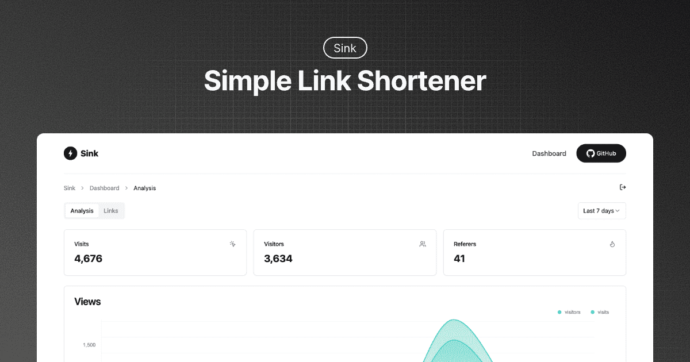
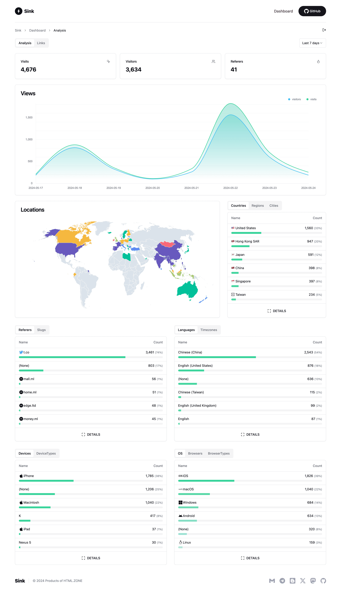
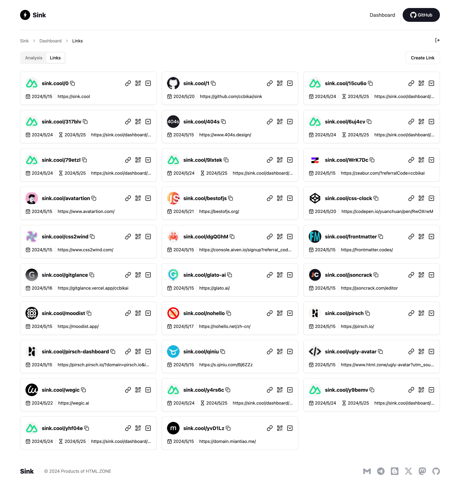
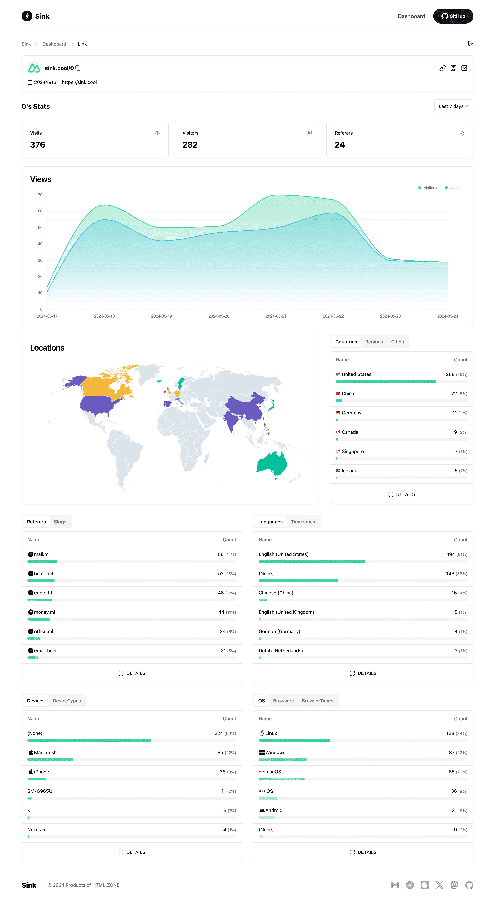

# ⚡ Sink

**A Simple / Speedy / Secure Link Shortener with Analytics, 100% run on Cloudflare.**

<a href="https://trendshift.io/repositories/10421" target="_blank">
  
</a>
<a href="https://news.ycombinator.com/item?id=40843683">
  
</a>




----

## ✨ Features

- **URL Shortening:** Compress your URLs to their minimal length.
- **Analytics:** Monitor link analytics and gather insightful statistics.
- **Serverless:** Deploy without the need for traditional servers.
- **Customizable Slug:** Support for personalized slugs.
- **🪄 AI Slug:** Leverage AI to generate slugs.
- **Link Expiration:** Set expiration dates for your links.

## 🪧 Demo

Experience the demo at [Sink.Cool](https://sink.cool/dashboard). Log in using the Site Token below:

```txt
Site Token: SinkCool
```

<details>
  <summary><b>Screenshots</b></summary>
  
  
  
</details>

## 🧱 Technologies Used

- **Framework**: [Nuxt](https://nuxt.com/)
- **Database**: [Cloudflare Workers KV](https://developers.cloudflare.com/kv/)
- **Analytics Engine**: [Cloudflare Workers Analytics Engine](https://developers.cloudflare.com/analytics/)
- **UI Components**: [Shadcn-vue](https://www.shadcn-vue.com/)
- **Styling:** [Tailwind CSS](https://tailwindcss.com/)
- **Deployment**: [Cloudflare](https://www.cloudflare.com/)
